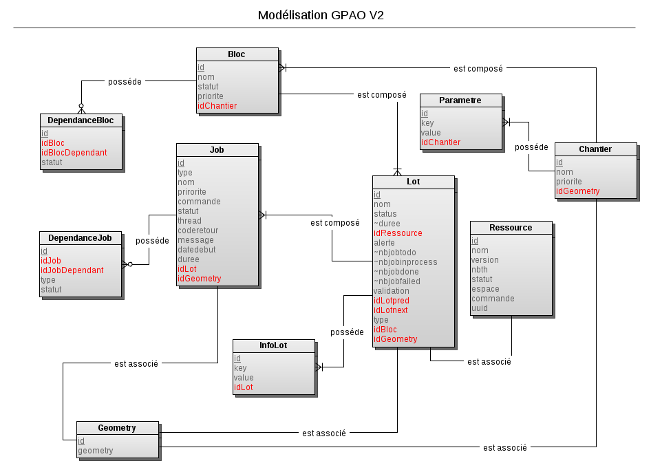
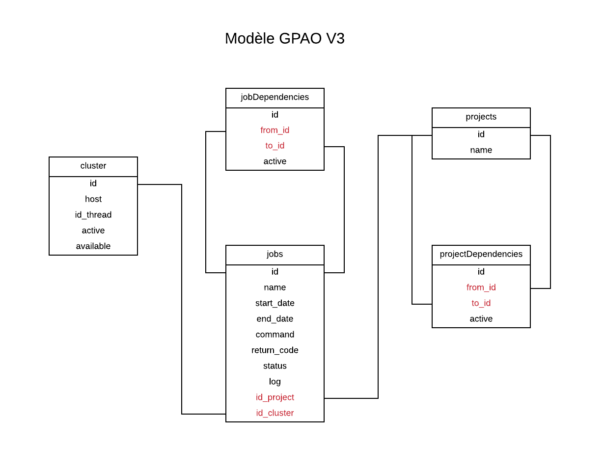
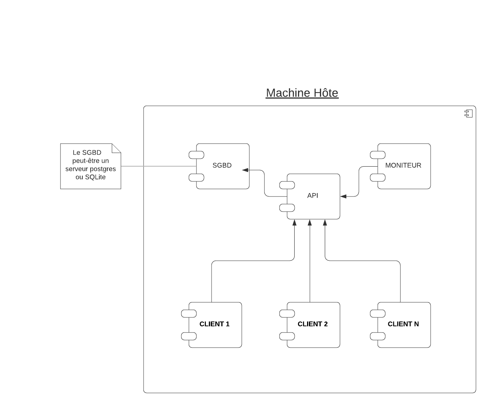

# Introduction

Ce projet a pour but de pouvoir lancer et de répartir des traitements sur plusieurs machines ou VM et de les traiter sur plusieurs cœurs de calcul.

Ce projet est sous licence CECILL-B (voir [LICENSE.md](LICENSE.md)).

# Modele de données

### Actuellement

### Dans le futur

Nous étudions une nouvelle approche de la problématique avec un nouveau modèle composée de 5 tables : 

- jobs

- project

- sessions

- jobDependencies

- projectDependencies

## Architecture en utilisant docker-compose

## Architecture en en utilisant docker swarm

ToDo : Faire un jolie schéma

## Ouverture des ports

| Service       | Port | Url                            |
|:------------- | ---- | ------------------------------ |
| Postgres      | 5432 |                                |
| Api           | 8080 | http://localhost:8080/api/**** |
| Api doc       | 8080 | http://localhost:8080/api/doc  |
| Moniteur      | 8000 | http://localhost:8000/         |
| Client 1... N |      |                                |

## Lancement de la stack

A la racine du projet se trouve le script `build-image.sh` à lancer impérativement à la première utilisation car il permet de construire les images composant la stack applicative.

Ensuite le script `start.sh` lance les différents service en s'appuyant sur le fichier descriptif `docker-compose.yml``.

[Installation du client](./client/INSTALL.md)

